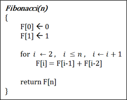

# 동적 프로그래밍

> 김주호, 현종일, 유현수, 이유현


## 2번




```python
def fibonacci(n):
    val = [0, 1]
    if n < 2:
        return val[n]
    else:
        for i in range(2, n+1):
            val.append(val[i-1] + val[i-2])
        return val[n]  
```

- 정확성 증명
  - fibonacii(1) = fibonacii(2) = 1이므로 위의 소스코드는 성립한다. 
  - n = k일때, fibonacii(1) .... fibonacii(k-1)이 F(1)... F(k-1)과 같다고 가정하자. 이때 F(k) = F(k-1) + F(k-2)이므로 fibonacii(k) = fibonacii(k-1) + fibonacii(k-2) = F(k) 가 성립한다. 따라서 fibonacii(n)을 호출하면 F(n)이 return 됨을 알 수 있다.

- 시간복잡도: O(2n + c) = O(n)